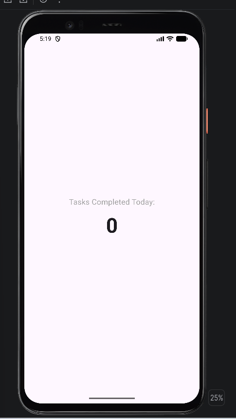
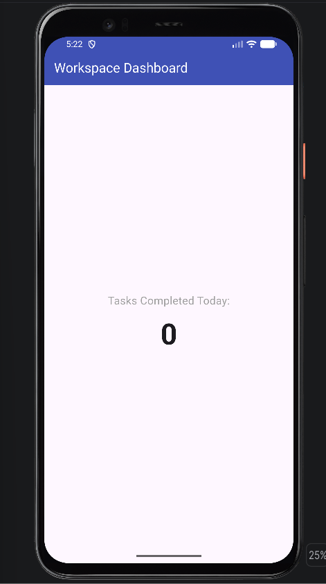
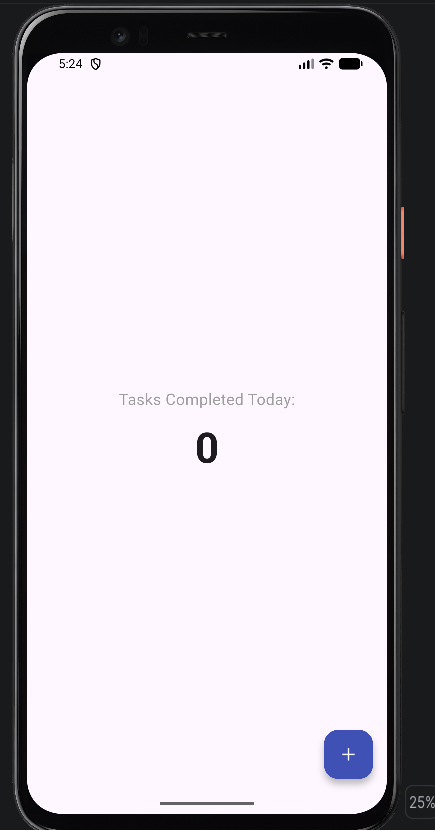
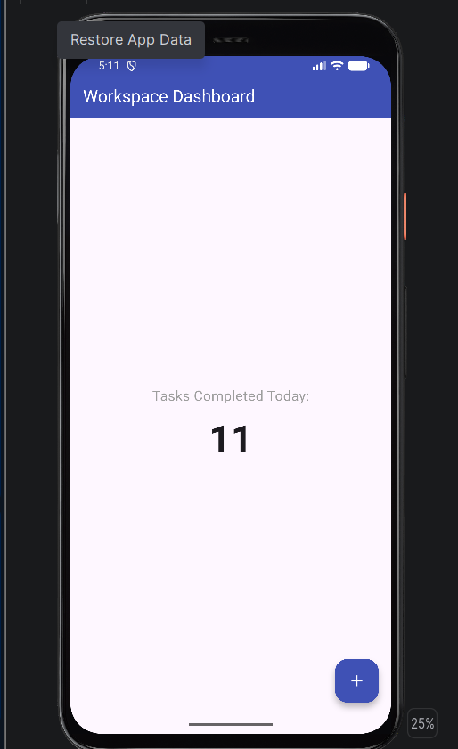

# Workspace Task Counter – Scaffold Demo

**Widget:** `Scaffold` — the structural skeleton of a Flutter screen that hosts a top bar, a main content area and a floating action button without manual positioning.

**In-class presentation date:** September 28, 2026

## Use Case
Every mobile screen requires a reliable structural skeleton so that UI elements do not overlap each other or get cut off by device status bars and notches. In this demo, I created a Workspace Task Counter screen. The `Scaffold` widget provides the foundational layout that hosts a top header bar, a centered main display area, and a persistent action trigger at the bottom without needing manual positioning or coordinate calculations.

## How to Run
1. Make sure Flutter is installed (`flutter doctor`).
2. Clone the repo:
   ```bash
   git clone https://github.com/Abdull-Kudus/flutter_scafold_widgets_layout.git
   cd flutter_scafold_widgets_layout
   ```
3. Get dependencies:
   ```bash
   flutter pub get
   ```
4. Run the app on an emulator, device or Chrome:
   ```bash
   flutter run
   ```

## The 3 Key Attributes of Scaffold

| Attribute | Default | What it does on screen |
|---|---|---|
| `appBar` | `null` (no top bar) | Displays a fixed toolbar across the top edge of the device, handling system status bar spacing and screen titles automatically. |
| `body` | `null` (empty screen) | Defines the primary viewing canvas of the screen between the top and bottom bars, holding layouts like columns, lists, or forms. |
| `floatingActionButton` | `null` (no button) | Anchors a circular button above the bottom-right corner of the interface for primary user actions. |

To demonstrate each attribute, I started with only the `body` and then uncommented `appBar` and `floatingActionButton` one at a time.

## Screenshots

**1. Body only**



**2. Body + appBar**



**3. Body + floatingActionButton**



**4. Final UI: body + appBar + floatingActionButton**



## Sources
- Flutter documentation – Scaffold class: https://api.flutter.dev/flutter/material/Scaffold-class.html

## AI Use Disclosure
I used Claude (Anthropic) to format my own written notes into this README layout and to add short comments to `lib/main.dart`. The app code, use case, attribute explanations and presentation were written by me.